# Athena Scheduler Demo

## Requirements

* A recent version of `docker`. The most recent stable release is recommended
* A recent version `docker-compose`. The most recent stable release is recommended
* Internet access to `hub.docker.com`, Google, and / or Microsoft

## Preperation

Before we can start the application, we need to prepare at least one authentication provider. Copy `auth-keys.env.sample` to
`auth-keys.env` in the root of this repository and then follow the directions for one or more of the providers listed below:

### Setting Up Google Authentication

> **NOTE:** If your google account belongs to a Google Apps organization you may be restricted from creating
> applications or enabling APIs. If you encounter this, you can create a free personal account to access the
> developer console. Users with accounts that belong to a Google Apps organization will still be able to log
> in to your application.

Sign in to the [Google Developer API Console](https://console.developers.google.com/projectselector/apis/library).
At the main dashboard, click `create` to create a project:

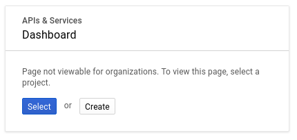

Give your project a name and click `Create`:

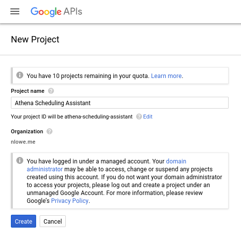

Next, we need to enable the Google+ API to allow users to sign in with their google account. With your project
selected, Select `Library` from the sidebar and search for `Google+`. Click `Google+ API` in the results and select
`Enable`.

> **NOTE:** We need the `Google+ API`, ***NOT*** the `Google+ Domains API` or `Google+ Hangouts API`

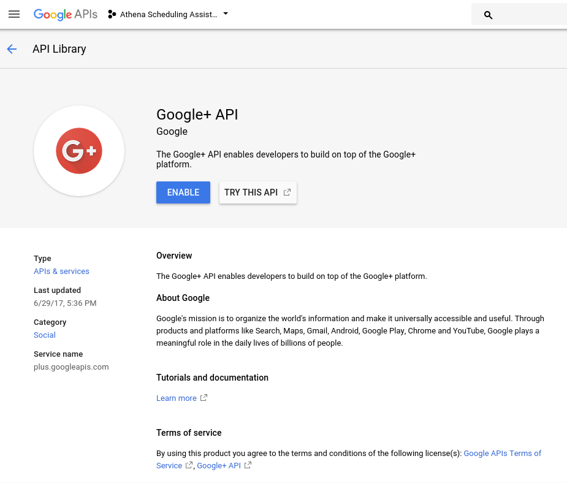

Now that the API is enabled, we need to create an OAuth key pair to use the API. With your project selected,
click on `Credentials` in the side bar. Select the `OAuth consent screen` tab. Enter a product name and click
`Save`:

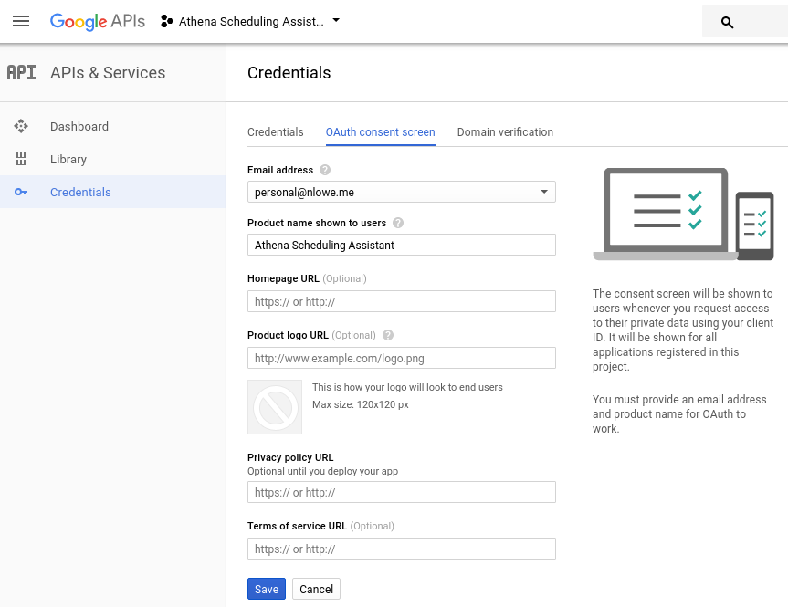

Go back to the `Credentials` tab. Select `Create Credentials` and then `OAuth Client ID`:

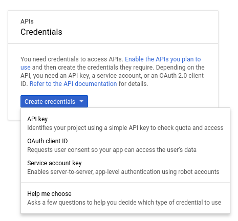

For the Application Type, choose `Web Application` and enter a name for the application. Finally, provide a
valid redirect url. This always ends with `/account/oauth/google`. For example, if your Athena instance is
hosted at `https://athena.myuniversity.edu`, the redirect URL would be `https://athena.myuniversity.edu/account/oauth/google`.
Since this demo is hosted on `localhost:5000`, we will use `http://localhost:5000/account/oauth/google`.
Click `Create` to generate your oauth client id and secret:

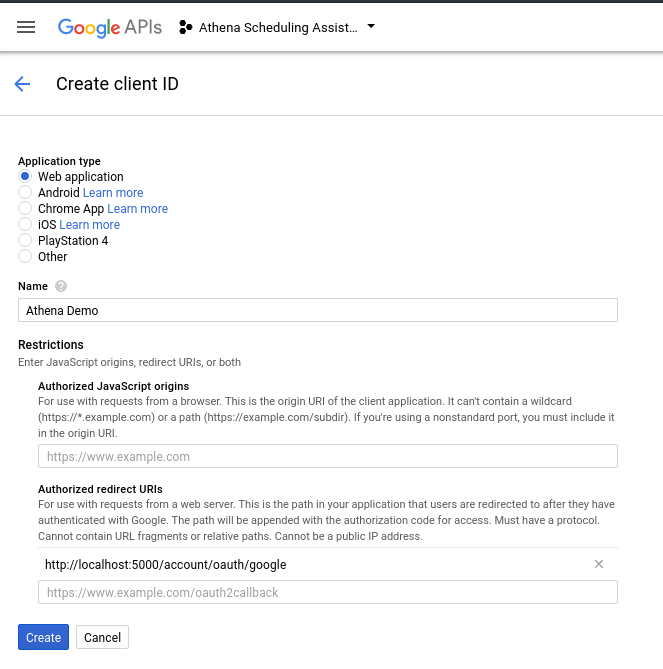

You should see a popup with your credentials:

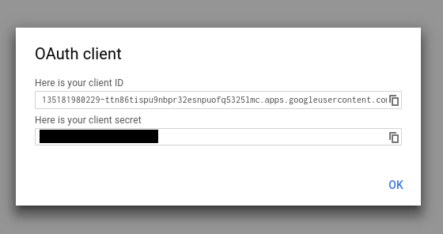

Edit `auth-keys.env` with your credentials. Set `AUTH_GOOGLE_CLIENT_KEY` to the `client ID` and
`AUTH_GOOGLE_CLIENT_SECRET` to the `client secret`:

```bash
# Required for Google Authentication
# See https://docs.microsoft.com/en-us/aspnet/core/security/authentication/social/google-logins?tabs=aspnetcore2x#create-the-app-in-google-api-console
AUTH_GOOGLE_CLIENT_KEY=135181980229-ttn86tispu9nbpr32esnpuofq5325lmc.apps.googleusercontent.com
AUTH_GOOGLE_CLIENT_SECRET=**********
```

### Setting Up Microsoft Authentication

> **NOTE:** If your microsoft account belongs to an Office 65 organization you may be restricted from creating
> applications or enabling APIs. If you encounter this, you can create a free personal account to access the
> developer console. Users with accounts that belong to an Office365 organization will still be able to log
> in to your application.

Sign in to the [Microsoft App Developer Console](https://apps.dev.microsoft.com/). At the main dashboard, select
`Add an app`:

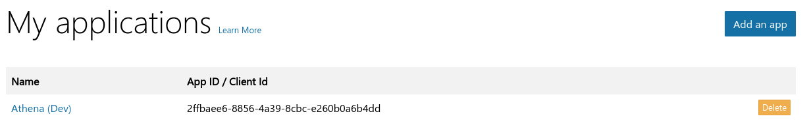

Give your application a name and click `Create`:

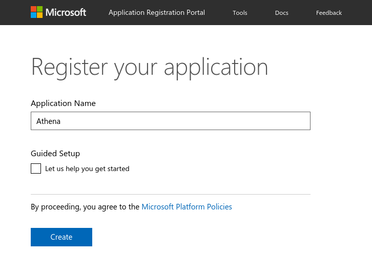

On the application configuration page, click `Add Platform` under `Platforms` and click `Web`:

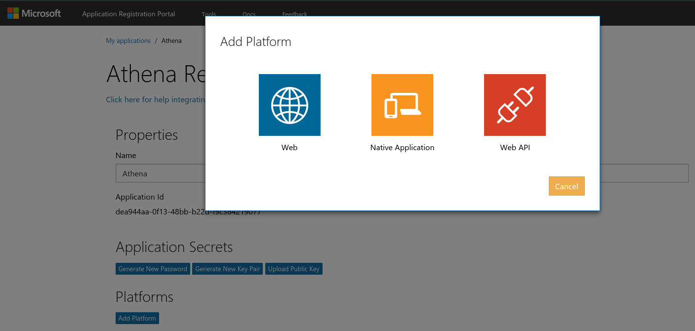

Provide a valid redirect url. This always ends with `/account/oauth/microsoft`. For example, if your Athena
instance is hosted at `https://athena.myuniversity.edu`, the redirect URL would be `https://athena.myuniversity.edu/account/oauth/microsoft`.
Since this demo is hosted on `localhost:5000`, we will use `http://localhost:5000/account/oauth/microsoft`:

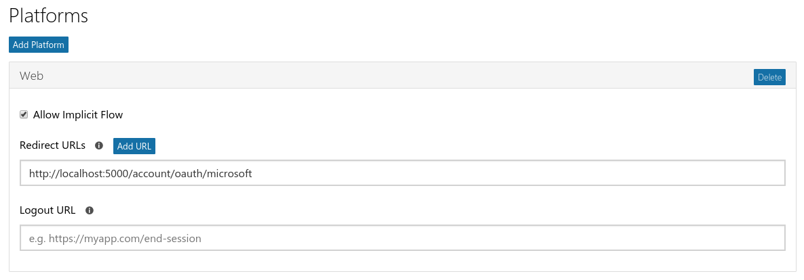

Save your changes. Under `Application Secrets`, select `Generate New Password`. Plase this password somewhere
secure, as you will not be able to view it again:

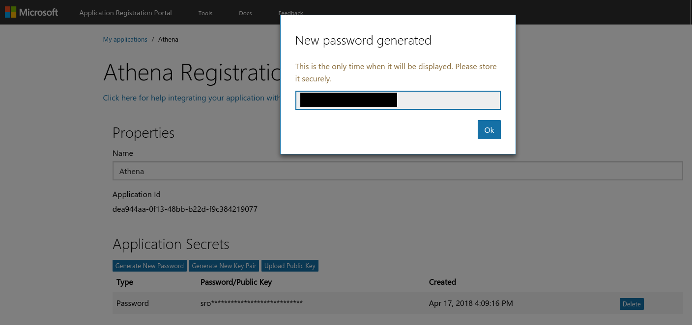

Edit `auth-keys.env` with your credentials. Set `AUTH_MICROSOFT_CLIENT_KEY` to the `Application ID` and
`AUTH_MICROSOFT_CLIENT_SECRET` to the password we previously saved:

```bash
# Required for Microsoft Authentication
# See https://docs.microsoft.com/en-us/aspnet/core/security/authentication/social/microsoft-logins?tabs=aspnetcore2x
AUTH_MICROSOFT_CLIENT_KEY=dea944aa-0f13-48bb-b22d-f9c384219077
AUTH_MICROSOFT_CLIENT_SECRET=****
```

### Pulling Images

To get the latest version of the scheduler and sample data, run `docker-compose pull` from the root of this repo:

```bash
$ docker-compose pull
Pulling db     ... done
Pulling athena ... done
```

## Starting the Application

We are now ready to start the application. From the root of the repository, run `docker-compose up -d`. To see output
from the application, run `docker-compose logs --follow`. This will start the database and the application. This
`docker-compose` file uses the sample data from [athenascheduler/athena](https://github.com/athena-scheduler/athena/tree/master/src/Athena.Importer/data).
The database will restore a backup containing this test data before starting. Once the application sees the database
has started, it will start listening for web requests:

```
db_1      | 2018-04-17 20:24:25.507 UTC [1] LOG:  database system is ready to accept connections
athena_1  | 2018-04-17 20:24:26 INF Ensuring database is migrated
athena_1  | Hosting environment: Production
athena_1  | Content root path: /
athena_1  | Now listening on: http://0.0.0.0:5000
athena_1  | Application started. Press Ctrl+C to shut down.
```

The application is now ready at http://localhost:5000/:

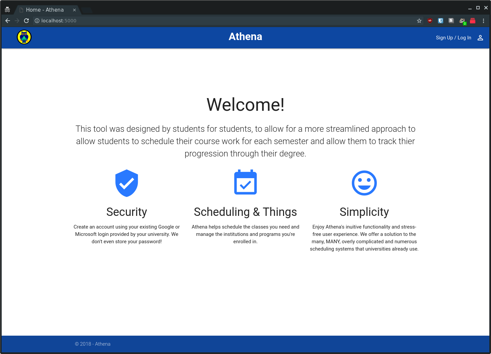

## Creating an Account

Click `Sign Up / Log In` in the top right and select one of the configured authentication providers:

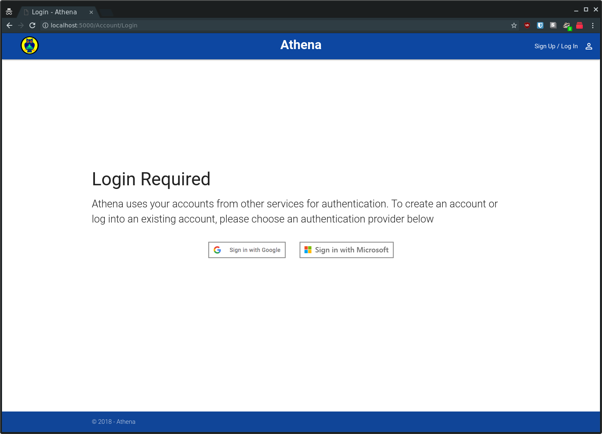

Verify that your information is correct and click `Create My Account`:

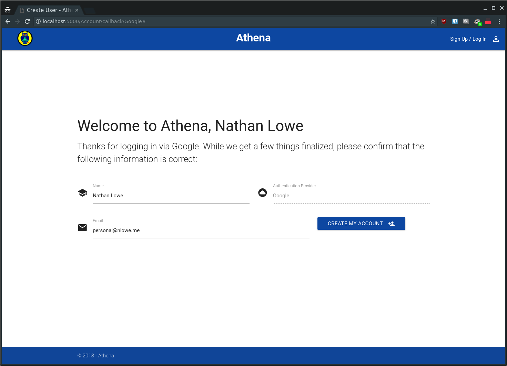

### Updating Your Profile

The first thing we need to do is tell athena what institutions and programs we are enrolled with. Search for
and add your institutions and programs here:

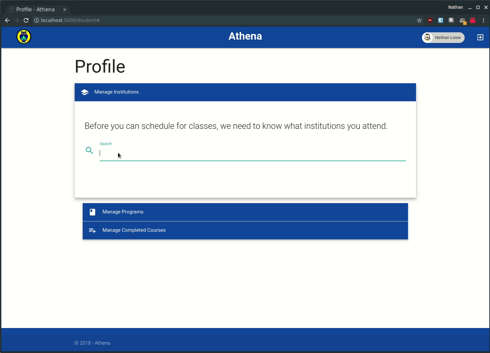

Click on the `Athena` logo to return to the home page.

## Scheduling for Classes

On the home page you see your current weekly schedule. Click the `Add` button on the right-hand side of the schedule
to bring up the search window. Here, you can search for courses to add to your schedule:

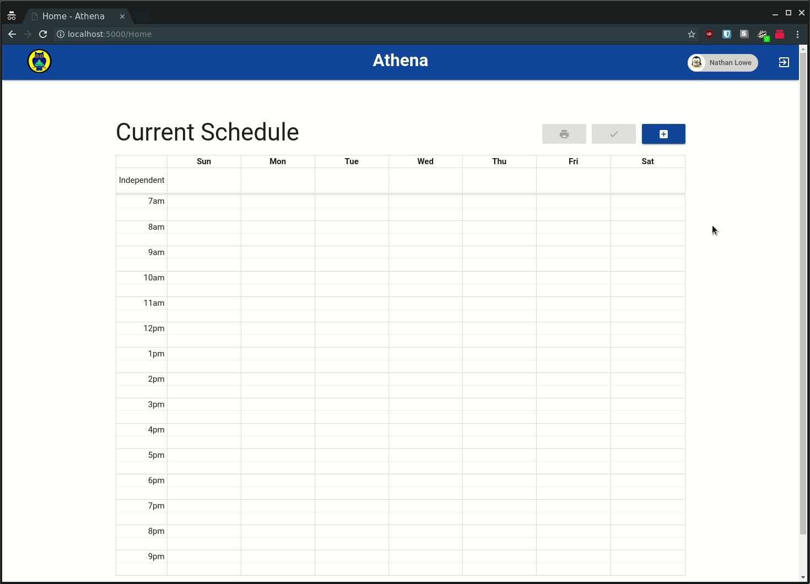

In the example above, I add the following to my schedule:

* MTHM 181 - Calculus I
* EECS 1000 - First Year Design
* EECS 1100 - Digital Logic Design

If you accidentially schedule for a class and need to remove it from your schedule, click the `x` on one of the meetings:

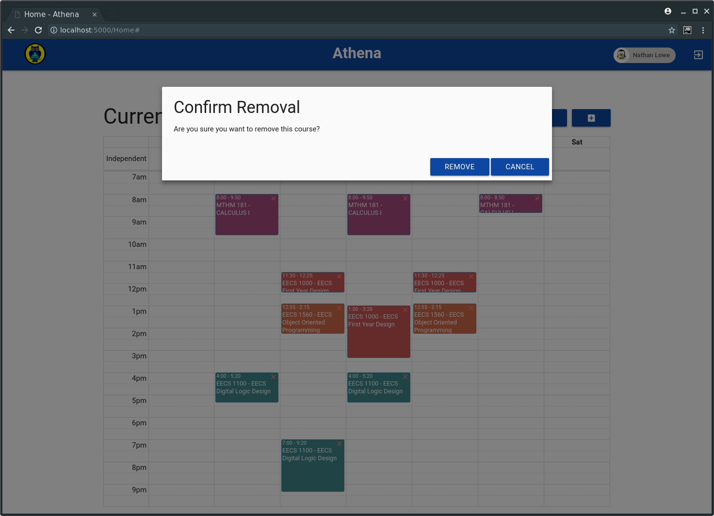

### Time Conflictss

If you attempt to schedule for a class that conflicts with another class on your schedule,  you will recieve an error
message and will be unable to register for the class:

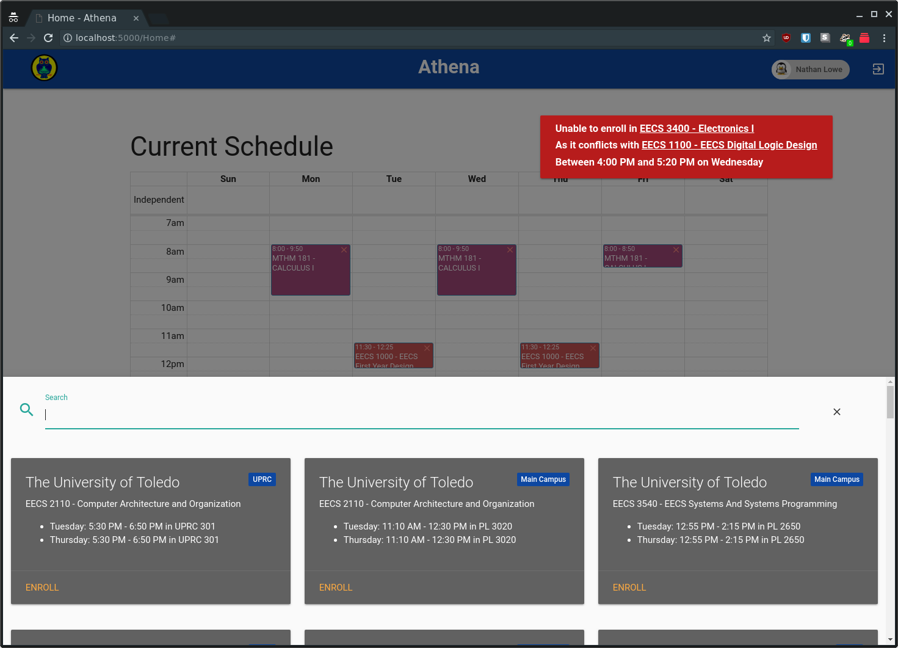

### Unmet Prerequisites

If you attempt to schedule for a class that you have not taken the prerequisites for, you will receive an error
dialog showing you what you are still missing:

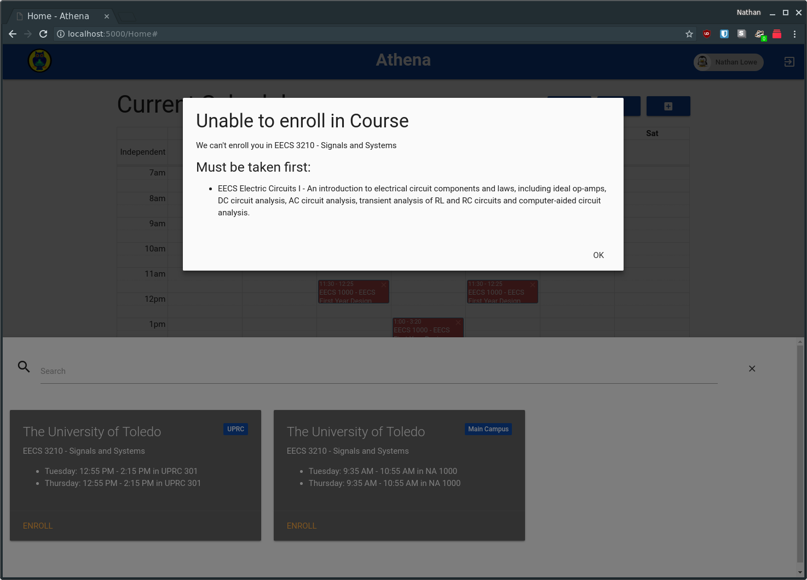

## Printing Your Schedule

Click the print button to print your schedule. Most browsers will also let you save your schedule as a PDF:

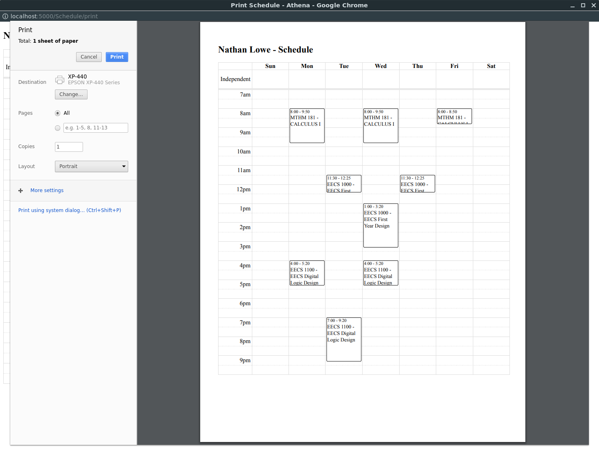

## Scheduling for the Next Semester

When you're ready to schedule for the next semester, you can click the check icon. This will mark all courses
on your schedule as complete and give you a blank schedule:

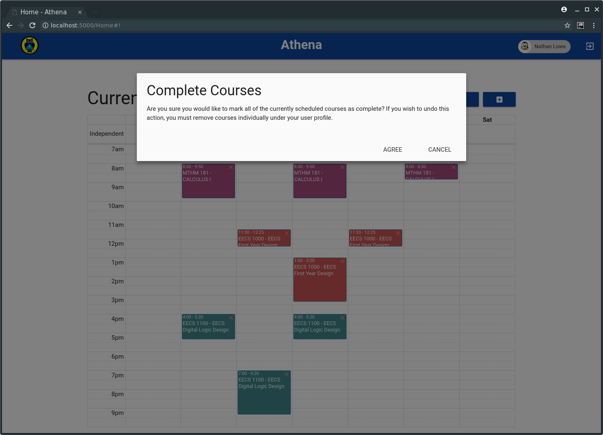

## Managing Your Profile

Click on your user name in the top right to access your profile page.

### Manage Institutions

If you cannot find certain courses in the scheduler, you may have to add an institution. From your profile, expand
the `Manage Institutions` tab. You can unenroll from any institutions here, and search for new institutions to enroll
with. To see more details about an institution, cllick the `Info` icon:

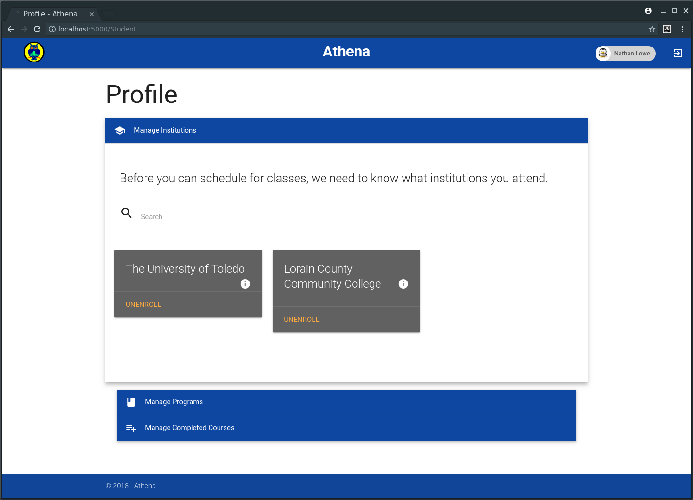

### Manage Programs

You can also manage what programs you are enrolled in:

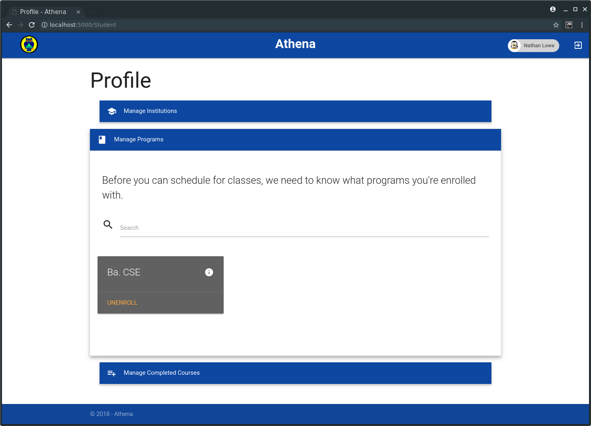

### Manage Completed Courses

From your profile, you can manage what courses you have already completed. This is useful if you are joining
an institution or starting to use athena partway through your educational career. The search box will filter
your currently completed courses:

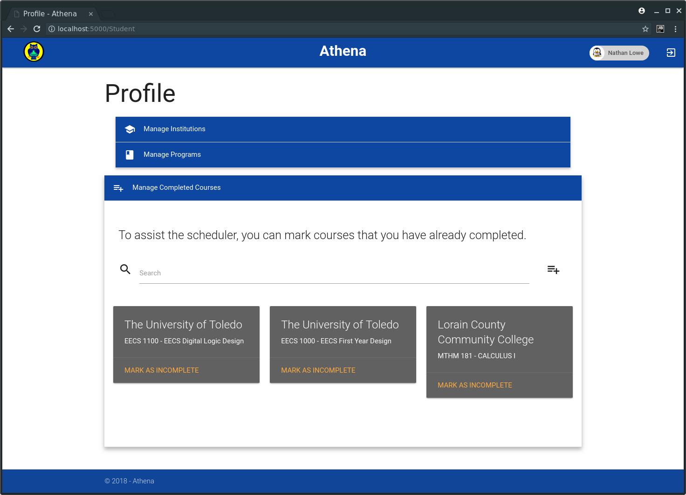

To mark a course as complete, click the add button on the right and use the search box to find the course:


